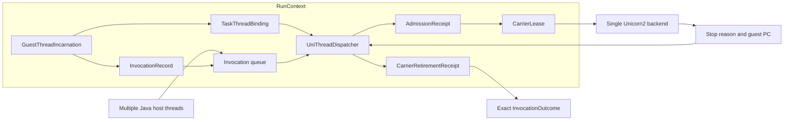

# unidbg-multithreading

[](https://github.com/mxyooR/unidbg-multithreading/actions/workflows/runtime.yml)
[](LICENSE)

Experimental `unidbg v0.9.8` fork for a generic **Guest Thread Runtime** and
single-backend multithreading.

> **Status: under development.**
>
> Multiple Java host threads can submit guest work while one emulator backend
> remains the source of truth. Guest work is interleaved at explicit stop and
> yield points; this is not simultaneous execution on multiple CPU cores.

This fork is intended to provide reusable runtime infrastructure. It does not
contain SO-specific names, command IDs, application routers, readiness rules,
or other business workflow.

## What is implemented

- Dispatcher-owned, serialized backend admission and retirement.
- Foreign host-thread submission with an invocation-owned completion result.
- Guest-thread identity independent of the Java host thread that happens to
  drive the backend.
- Explicit persistent guest-thread registration and rebinding for calls that
  must share thread-scoped state across invocation carriers.
- Per-guest-thread `errno`, `JNIEnv` attachment, pending exception, and
  attachment state.
- GuestThread-owned native stack allocation for managed bindings, with real
  backend canary read-back and carrier `TaskStackEvidence`.
- Saved backend contexts carry a `SavedContextOwnership` proof tied to the
  exact task binding, binding epoch, GuestThread incarnation, invocation
  generation, stack allocation, and (when exposed) AArch64 `TPIDR_EL0`; stale
  restores fail closed and quarantine the run.
- GuestThread stack-canary corruption raises a typed stack-integrity fault,
  quarantines the run, records a root-fault publication, and rejects later
  backend admission.
- Invocation-scoped JNI local-reference lifetime.
- Typed wait dependencies with atomic batch publication and cycle detection.
- Root-fault quarantine, transitive dependent snapshots, and terminal evidence
  for diagnostics.
- Strict LIFO continuation validation with explicit re-entry modes.
- Unicorn2 stop-reason and guest-PC evidence for native instruction budgets and
  cross-thread stop requests.

The runtime is exercised with generic ARM32/ARM64 instructions and anonymous
tasks. The tests do not require a target library or application protocol.

## Quick start

The smallest useful integration creates one persistent guest-thread identity,
binds a carrier, and submits it through the dispatcher. The backend remains
owned by the dispatcher even when the call originates on another Java thread:

```java
AndroidEmulator emulator = AndroidEmulatorBuilder.for64Bit()
        .addBackendFactory(new Unicorn2Factory(true))
        .setProcessName("generic-runtime-example")
        .build();
try {
    long function = 0x100000000L;
    Backend backend = emulator.getBackend();
    backend.mem_map(function, 0x1000, 7);
    backend.mem_write(function, new byte[]{
            0x00, 0x04, 0x00, (byte) 0x91,       // add x0, x0, #1
            (byte) 0xc0, 0x03, 0x5f, (byte) 0xd6 // ret
    });

    ThreadDispatcher dispatcher = emulator.getThreadDispatcher();
    GuestThreadIncarnation guestThread = dispatcher.registerGuestThread(
            0x7100, "caller-owned-guest-thread");
    NativeWorkerTask64 task = new NativeWorkerTask64(
            guestThread.getGuestTid(), function, emulator.getReturnAddress(),
            false, 41L);
    dispatcher.bindGuestThread(guestThread, task);
    try (InvocationOutcome outcome = dispatcher.runThreadForOutcome(task,
            InvocationContext.builder().operation("increment").build())) {
        if (!outcome.getResult().isCompleted()) {
            throw new IllegalStateException("guest call failed",
                    outcome.getResult().getFault());
        }
        System.out.println(outcome.getValue()); // 42
    }
    dispatcher.retireGuestThread(guestThread);
} finally {
    emulator.close();
}
```

This example uses only anonymous instructions. A complete ARM32/ARM64 version,
including concurrent host callers and negative-control checks, is maintained in
[`InvocationOwnedRuntimeTest`](unidbg-android/src/test/java/com/github/unidbg/android/InvocationOwnedRuntimeTest.java).

## What this is useful for

This runtime is intended for tools that need to submit several native calls
through one emulator instance while preserving a logical guest thread's state:

- multiple Java callers can submit work without directly racing the backend;
- one guest-thread identity can survive successive invocation carriers;
- invocation outcomes, faults, timeouts, and cleanup remain attributable to the
  exact call that owns them;
- stale CPU context and corrupted managed stack evidence fail closed.

It is an infrastructure layer. Loader policy, JNI business behavior, protocol
handling, target-library setup, and application state should remain in the
integrating project.

## Current limitations

This project does not yet claim production-complete guest threading:

- One backend is still serialized. There is no true parallel guest execution
  or multi-core memory-consistency model.
- Synchronous guest re-entry from the current dispatcher owner is validated as
  a contract but is currently rejected; nested backend execution is not wired
  through a real callback return boundary yet.
- CPU register contexts and continuation snapshots remain stored on the task,
  but a managed saved context is not restorable by handle alone: its ownership
  proof must still match the live binding and invocation admission. Managed
  GuestThread bindings own and reuse one real worker-stack allocation with
  canary evidence; unbound legacy tasks retain their task-owned fallback stack.
- Full pthread/TCB/TLS, signal, futex-owner, and thread-exit semantics are not
  represented by the guest-thread object yet.
- Cancellation and timeout are cooperative and depend on a supported stop
  point. Backend parity has been verified most directly with Unicorn2.
- Backend hooks, VM globals, loader state, memory, and file descriptors remain
  shared run resources.
- APIs and lifecycle contracts may change while the runtime is under
  development.

## Runtime model

The implementation separates four identities:

| Layer | Responsibility |
| --- | --- |
| `RunContext` | Run identity, guest-thread registry, invocation records, wait graph, fault state, and terminal evidence |
| `GuestThreadIncarnation` | Stable guest-thread incarnation, guest TID, errno, `JNIEnv`, pending exception, `StackRegion`, and continuation stack |
| `InvocationRecord` | One call's context, completion, JNI local-reference scope, and terminal state |
| `CarrierLease` | Temporary proof that one invocation may drive the backend |

The backend owner admits one carrier at a time, restores the task's CPU state,
drives it until a stop or yield point, retires the carrier, and only then
publishes the invocation terminal. A guest TID can be reused only after the
previous incarnation retires; incarnation IDs prevent stale-identity (ABA)
errors.



The four identities are intentionally different:

```text
Host Java Thread != Guest Thread
Task / Carrier     != Guest Thread
Invocation         != Guest Thread
Observed Role      != Guest Thread Identity
```

See the detailed design and API notes in
[`docs/single-backend-multithreading.md`](docs/single-backend-multithreading.md).

## Generic integration boundary

Application code can provide a `ThreadTask` and submit it through
`ThreadDispatcher.runThreadForOutcome` or `submitInvocation`. The dispatcher
owns backend admission, guest-thread binding, suspension, retirement, and
terminal publication. Application routing, command handling, readiness policy,
and library-specific state belong above this runtime.

The public entry points currently include:

- `Emulator.eFuncForOutcome`
- `Module.emulateFunctionForOutcome`
- `ThreadDispatcher.submitInvocation`
- `ThreadDispatcher.runThreadForOutcome`
- `ThreadDispatcher.registerGuestThread`, `bindGuestThread`, and
  `retireGuestThread`
- `DvmObject.callJniMethodOutcome`
- `DvmClass.callStaticJniMethodOutcome`

Callers must consume the returned outcome and acknowledge it. For the JNI
object helpers, close the nested `InvocationOutcome` obtained from
`JniInvocationOutcome.getInvocationOutcome()`; reference-scope cleanup is
completed only after carrier retirement and outcome acknowledgement.

## Build

Requirements:

- JDK 8 or newer
- Maven or the included Maven wrapper

Compile the Java modules and package the checked-in native artifacts:

```text
& .\mvnw.cmd '-DskipTests' 'package'
```

The Maven build packages platform-specific native binaries as-is. It does not
rebuild the Unicorn JNI library or claim that every optional native backend is
available on every host platform.

Run the focused runtime tests with:

```text
& .\mvnw.cmd '-pl' 'unidbg-android' '-am' '-Dmaven.test.skip=false' '-DskipTests=false' '-DfailIfNoTests=false' '-Dtest=GuestThreadRuntimeTest,InvocationRecordTest,RunWaitGraphTest,InvocationOwnedRuntimeTest,GuestThreadJniRuntimeTest,UnicornStopReasonTest' 'test'
```

The repository also publishes the same checks as a GitHub Actions workflow at
[`runtime.yml`](.github/workflows/runtime.yml). Linux runs the API model tests
and Java package build. Windows runs the checked-in Unicorn2 native bridge,
stop-reason tests, and generic Android ARM32/ARM64 runtime tests. This split is
intentional: native stop-reason parity is not claimed for the checked-in Linux
bridge yet.

## Contributing and roadmap

The next useful contributions are ARM32/ARM64 parity checks, lifecycle fault
tests, backend capability smoke tests, and documentation improvements. New
target-specific SO logic is intentionally out of scope. See
[`CONTRIBUTING.md`](CONTRIBUTING.md) for the test and review contract.

## Design references

- [Single-backend multithreading architecture notes](https://bbs.kanxue.com/thread-292140.htm)
- [Invocation-owned runtime evolution notes](https://bbs.kanxue.com/thread-292016.htm)

## Relationship to upstream unidbg

This repository is based on [unidbg](https://github.com/zhkl0228/unidbg)
`v0.9.8`. The emulator, Android, iOS, and backend capabilities inherited from
upstream remain available; this fork focuses on the generic runtime migration
described above.

## License and acknowledgements

unidbg is licensed under the Apache License 2.0. See [`LICENSE`](LICENSE) and
the upstream project for the complete attribution and dependency history.

This project builds on the work of the unidbg, Unicorn, Dynarmic, HookZz,
xHook, AndroidNativeEmu, usercorn, Keystone, Capstone, idaemu, jelf, Whale,
Kaitai Struct, fishhook, runtime_class-dump, and mman-win32 projects.
