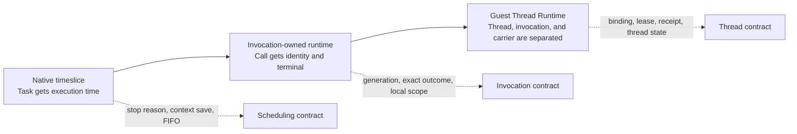
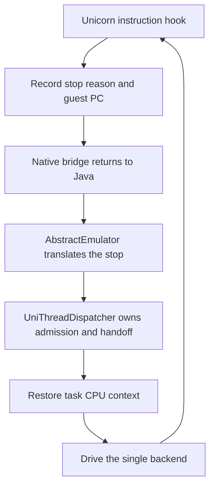
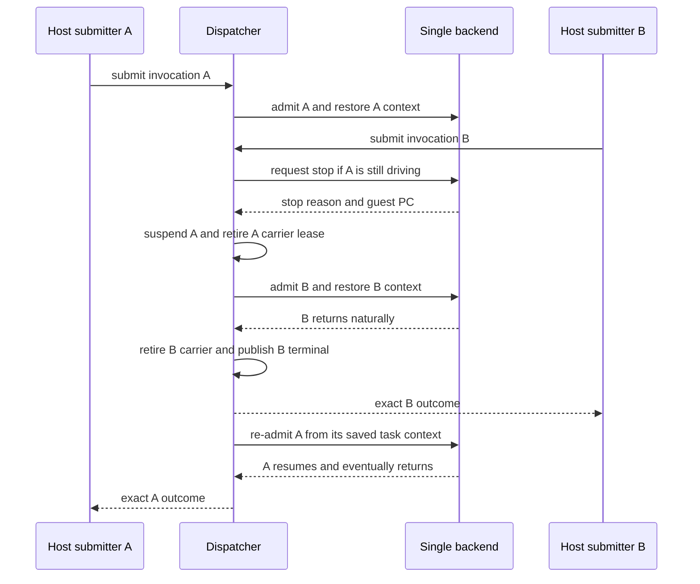

# Single-backend multithreading

This experimental `v0.9.8` fork accepts guest work from multiple Java host
threads while keeping one emulator backend as the source of truth. Runtime
admission uses generic identities and evidence. It does not depend on a library
name, native command ID, or application workflow.

The Guest Thread Runtime migration is under development. One backend still
executes one carrier at a time; this is deterministic interleaving at explicit
stop and yield points, not simultaneous multi-core guest execution.

## Evolution in one view

The migration follows the three stages described in the architecture notes:

The later stage does not remove the earlier one. Native stop reasons still
provide the safe points used by the dispatcher; invocation ownership gives
each overlapping call an exact lifecycle; the Guest Thread Runtime assigns
thread-level state that must survive carrier changes.

## Ownership model

The runtime separates four identities:

| Layer | Owns | Does not own |
| --- | --- | --- |
| `RunContext` | one emulator-run identity, guest-thread registry, active invocations, wait graph, fault and terminal evidence | application workflow |
| `GuestThreadIncarnation` | stable incarnation ID, guest TID, errno, `JNIEnv`, pending exception, thread attachments, `StackRegion`, invocation stack | one host Java thread |
| `InvocationRecord` | one call ID and generation, immutable context, completion, JNI local-reference scope, terminal | persistent guest-thread identity |
| `CarrierLease` | temporary permission to drive the backend, proven by admission and retirement receipts | guest TID or JNI identity |

A guest TID may be reused only after the old thread retires. The monotonically
increasing incarnation ID keeps the old and new threads distinct and prevents
TID-based ABA errors.

Ordinary dispatcher-created tasks use `TRANSIENT_CARRIER` bindings and retire
their synthetic guest-thread identity with the task. A caller that needs
thread-scoped state across several invocation carriers can instead call
`ThreadDispatcher.registerGuestThread`, bind each carrier with
`bindGuestThread`, and explicitly call `retireGuestThread` after the final
binding has ended. Each rebind advances the binding epoch without changing the
guest-thread incarnation, errno, JNI attachment, or pending-exception owner.

Managed bindings allocate one real worker stack through the
`GuestThreadIncarnation`. The logical `StackRegion` and its canary remain live
after a carrier is retired, and each carrier records its exact entry SP in a
`TaskStackEvidence` object. Backend register contexts and continuation
snapshots are still stored on the task, but managed contexts also carry a
`SavedContextOwnership` proof. Tasks without a runtime binding use the legacy
task-owned stack fallback.

### Saved context ownership

The native context handle is only a physical storage slot; it is not an
identity. On every managed `saveContext`, the runtime records the exact task,
`TaskThreadBinding` identity and epoch, `GuestThreadIncarnation` identity, and
the currently admitted invocation ID/generation when the save occurs during an
invocation. The proof also records the stack allocation/canary evidence. On
restore, the dispatcher must present the same live binding and, for an
invocation context, a new live admission for the same invocation generation.
The real stack allocation and canary must still match. On AArch64, when the
backend exposes `TPIDR_EL0`, the value captured with the context is checked
again after the native restore.

Any mismatch raises `SavedContextOwnershipException`, publishes a generic
runtime-integrity root fault, and prevents the run from accepting new
admissions. This is a generic stale-context/ABA guard; it does not infer
identity from a Java host thread, process role, command ID, or application
workflow. Unbound legacy tasks keep the pre-runtime context path.

## Dispatch and handoff

1. The first caller atomically becomes the backend owner and starts the
   dispatcher loop.
2. A call from another host thread becomes a `ThreadTask` with an exact
   `InvocationRecord` and enters the external queue.
3. The owner drains the queue, admits one carrier lease, restores that task's
   CPU context, and drives the backend.
4. A context switch, futex wait, signal path, backend stop, or native
   instruction budget can suspend the task. The lease retires before another
   invocation is admitted.
5. Completion, fault, timeout, or cancellation is published through the
   invocation's private future only after carrier retirement.

The submitting foreign host thread waits for its own outcome and never invokes
the backend directly. Idle owner selection and first submission are one
synchronized operation, including when two callers start at the same time.

Unicorn2 records a stop reason and guest PC for each run. Its instruction-budget
hook requests a timeslice stop from the code hook, while cross-thread stop
requests use the bridge's stop flag. Other backends retain their existing
behavior through optional backend capability methods.

### Backend boundary

The native bridge reports why execution stopped; it does not decide which
invocation runs next. That decision remains in the Java dispatcher:

`TIMESLICE`, `BACKEND_STOP`, and `FUTEX_WAIT` are transport states in this
pipeline. None of them is a completed invocation. Only a natural return or an
exact terminal request can produce an `InvocationOutcome`, and publication is
still delayed until carrier retirement.

### A/B backend handoff

The normal cross-host-thread handoff is an interleaving sequence, not parallel
execution:

The sequence makes two ownership rules visible: a foreign submitter never
drives the backend directly, and a stop used to hand the backend to B cannot
be reported as A's completion.

## Invocation outcomes

`InvocationResult` distinguishes the following terminal states:

- `COMPLETED` carries the exact return value, including a distinct null value.
- `FAULT` retains the original failure.
- `TIMEOUT` and `CANCELLED` retain the requesting invocation's ownership.

`InvocationOutcome` couples a terminal to its exact invocation. Callers close
the outcome, or call `acknowledgeOutcome()`, after consuming it. An invocation
reference scope is released only after both carrier retirement and outcome
acknowledgement.

The public generic entry points are:

- `Emulator.eFuncForOutcome`
- `Module.emulateFunctionForOutcome`
- `ThreadDispatcher.submitInvocation` and `runThreadForOutcome`
- `ThreadDispatcher.registerGuestThread`, `bindGuestThread`, and
  `retireGuestThread`
- `DvmObject.callJniMethodOutcome` and `callJniMethodObjectOutcome`
- `DvmClass.callStaticJniMethodOutcome` and
  `callStaticJniMethodObjectOutcome`

Cancellation and timeout are cooperative. The request enters quiescing first;
the terminal is completed after the carrier stops and its task resources have
been retired.

## Guest-thread JNI state

`ThreadIdentityProvider` resolves the currently admitted guest thread instead
of using the host Java thread as guest identity. Each active guest thread has a
stable `JNIEnv` pointer and its own pending-exception slot. The 32-bit and
64-bit `AttachCurrentThread`, `DetachCurrentThread`, and `GetEnv` paths use that
guest-thread attachment.

JNI local references are intentionally invocation-scoped rather than
thread-scoped. `PushLocalFrame`, `PopLocalFrame`, and `DeleteLocalRef` therefore
operate on the active invocation scope, while `JNIEnv` and pending exceptions
remain stable across calls on the same guest thread.

## Wait, fault, and terminal evidence

`RunWaitGraph` publishes typed dependency batches atomically. Supported
dependency identities include exact invocations, futex address/value pairs,
guest-thread incarnations, callback mailboxes, and external resources. A batch
that introduces an invocation cycle is rejected without changing the graph
epoch or publishing a partial edge set.

When an invocation becomes terminal, both its outgoing and incoming invocation
edges are removed. `RootFaultController` first quarantines the run, which
freezes new admission, and only then snapshots transitive dependents while the
graph evidence is intact.

The run terminal ledger records immutable `InvocationEvidence`: run, guest
thread, invocation/generation, terminal, and all admission and retirement
receipts. This is runtime evidence, not an application readiness policy.

## Continuation status

`InvocationStack` enforces strict LIFO continuation ordering. The model carries
an explicit `ReentryMode`, exact parent continuation ID, guest-thread identity,
binding epoch, and stack depth. It rejects a child attached to the wrong parent,
thread, binding epoch, or depth, and rejects non-LIFO completion.

This contract is not yet a production nested-backend implementation. A
synchronous guest call submitted from the current dispatcher owner is still
rejected. Completing this path requires a real callback return boundary,
backend CPU snapshot, non-overlapping child ABI frame, and exact parent restore;
placing the child in the ordinary FIFO would deadlock behind its parent.

Same-thread synchronous re-entry, same-thread asynchronous mailbox work, and
cross-thread synchronous submission must remain distinct modes.

## Implementation status

This matrix separates the generic runtime that is present in this fork from
the longer-term thread-semantics goals in the architecture notes:

| Capability | Status | Evidence or boundary |
| --- | --- | --- |
| Native timeslice stop reason and guest PC | Implemented for Unicorn2 | `BackendStopReason`, bridge stop flag, and focused backend tests |
| Serialized backend ownership and foreign submission | Implemented | `UniThreadDispatcher` and generic Android handoff tests |
| Invocation identity, generation, context, and exact terminal | Implemented | `InvocationRecord`, `InvocationOutcome`, and ownership checks |
| Guest-thread incarnation, persistent rebinding, errno, `JNIEnv`, and pending exception | Implemented | Explicit bindings survive invocation carriers; transient dispatcher bindings retain legacy lifetime |
| Saved backend-context ownership and stale-restore rejection | Implemented for managed bindings | `SavedContextOwnership` checks binding/epoch, GuestThread incarnation, invocation generation, stack evidence, and optional AArch64 `TPIDR_EL0` |
| Invocation local frames and two-condition cleanup | Implemented | `InvocationLocalReferenceScope` and JNI outcome tests |
| Typed wait graph, cycle rejection, fault quarantine, and terminal ledger | Implemented | `RunWaitGraph`, `RootFaultController`, and evidence tests |
| Strict LIFO continuation contract | Model implemented | Wrong parent, thread, epoch, depth, and completion order are rejected |
| Synchronous owner-thread nested backend execution | Not implemented | The public path rejects it to avoid a FIFO deadlock |
| Persistent guest-thread stack allocation and canary evidence | Implemented for managed bindings | `StackRegion` owns logical bounds; `TaskStackEvidence` reads the real backend canary and entry SP; saved CPU context remains task-stored but ownership-checked |
| Full pthread/TCB/TLS, signal, futex-owner, and thread-exit semantics | Not implemented | No claim of complete Android kernel or Bionic thread emulation |
| Uniform behavior across optional native backends | Not claimed | Exact stop evidence is currently verified most directly with Unicorn2 |

"Implemented" here means the generic contract is present and covered by the
repository's current tests. It does not mean that every Android thread API or
every backend has production-complete semantics.

## Configuration

The native instruction budget is enabled only when the dispatcher has more than
one runnable source. Set `unidbg.nativeTimesliceBudget` as a Java system property
or environment value to change the default budget of `100000` guest
instructions. Values less than or equal to zero disable it for that run.

Exact stop-reason and cross-thread stop evidence is currently verified with
Unicorn2. Custom backends remain source-compatible through no-op capability
defaults.

## Verified contracts

The repository tests use anonymous ARM instructions and generic runtime tasks.
The evidence is intentionally read in three layers:

| Layer | What it proves | What it does not prove |
| --- | --- | --- |
| Model contract | Identity, state transitions, receipt matching, wait cycles, and LIFO rules | That a production caller reaches the authority |
| Production-connected contract | Dispatcher, emulator, DVM/JNI, and backend entry points use the same runtime ownership | Complete behavior of every optional backend |
| Runtime scenario | Multiple host threads interleave through a real backend and preserve isolation | True SMP or device-level scheduling equivalence |

The generic tests do not use a target SO, command protocol, readiness graph, or
application-specific state. A passing model test is therefore evidence for the
runtime contract it names, not evidence for an unrelated application workflow.

The current generic contracts include:

- two simultaneous idle callers acquire exactly one backend owner;
- a foreign caller receives a turn and register results survive suspend/restore;
- guest threads have distinct live TIDs, incarnation IDs, and `JNIEnv` pointers;
- an explicit guest thread preserves thread state across multiple invocation
  carriers and advances its binding epoch;
- managed carriers reuse the same backend stack allocation for one guest thread,
  with a read-back canary and entry-SP evidence;
- saved backend contexts reject a rebound task binding and a stale invocation
  generation before native restore;
- errno and pending JNI exceptions do not cross guest-thread boundaries;
- admission and retirement receipts balance in terminal evidence;
- cancellation, timeout, ownership mismatch, and two-latch reference cleanup;
- atomic multi-edge publication, whole-graph cycle rejection, terminal edge
  cleanup, root-fault ordering, and transitive dependent snapshots;
- strict LIFO parent/child continuation behavior;
- Unicorn2 timeslice and cross-thread stop reasons.

## Current limitations

- The single backend is serialized. There is no true parallel guest execution
  or multi-core memory-consistency model.
- Synchronous owner-thread guest re-entry has a model contract but no production
  nested-backend path and is rejected.
- Backend CPU contexts and continuation snapshots remain task-stored. Managed
  contexts are additionally bound to a live task/binding/invocation proof and
  are rejected after an epoch or generation change. Managed bindings use
  persistent GuestThread-owned stack regions with canary evidence; unbound
  legacy tasks still use task-owned fallback stacks.
- Full pthread/TCB/TLS, signal, futex-owner, and thread-exit semantics are not
  yet represented by the guest-thread object.
- Cancellation depends on reaching a supported stop point. The current run
  close path does not claim a complete quiescence proof for every backend hook.
- Backend hooks, VM globals, loader state, memory, and file descriptors remain
  shared run resources. This fork does not claim isolation of every emulator
  subsystem.
- Exact stop-reason behavior has been exercised with Unicorn2; parity across all
  optional backends is not claimed.
- APIs and lifecycle contracts may change while the Guest Thread Runtime is
  under development.
- Checked-in native binaries are platform-specific and are packaged as-is by
  Maven; the Java build does not rebuild them.

## Extension boundary

A generic integration may implement another `ThreadTask` and call
`ThreadDispatcher.runThreadForOutcome`. It must initialize all guest-visible
registers, bind a carrier before dispatch, and let the dispatcher own backend
admission. Managed bindings receive a GuestThread-owned stack allocation;
unbound legacy tasks retain the isolated task-stack fallback. Application
routing, command IDs, readiness rules, and SO-specific state belong above this
runtime and must not be added to dispatcher or guest identity code.

When several tasks represent successive calls on one logical guest thread,
register that guest thread once and bind each task before submission. The
dispatcher detaches the persistent binding after carrier cleanup but does not
retire the incarnation. Explicit retirement is rejected while a binding is
still active and should occur only after the final outcome is consumed.
